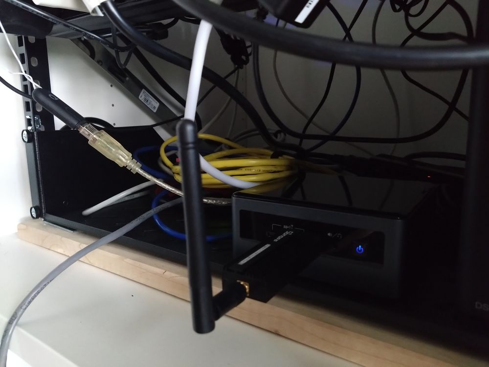

# home-assistant-config

Welcome to my Home Assistant configuration.
I mainly focus on using cloudless solution for controling and managing my devices.

# Hardware

## Core
Intel Nuc 10 (Intel Core i3-10110U CPU with 16GB of RAM).

I'm running HAOS as a virtual machine on Proxmox in a 2 core 4GB VM.

On the same Proxmox cluster I have the following LXC containers to support HA:

* Postgresql v15
* InfluxDB v2
* Mosquitto MQTT broker

Raspberrymatic is running a Raspberry Pi-3B which boots from a USB SSD.

## Bridges
| Device                            | Integration                                                   | Remarks                      |
|-----------------------------------|---------------------------------------------------------------|------------------------------|
| Conbee II USB Stick               | [Deconz](https://www.home-assistant.io/integrations/deconz/)  | 
| SONOFF ZigBee 3.0 USB Dongle Plus | [ZHA](https://www.home-assistant.io/integrations/zha/)        | TI CC2652P
| [HM-MOD-RPI-PCB](https://de.elv.com/elv-homematic-komplettbausatz-funkmodul-fuer-raspberry-pi-hm-mod-rpi-pcb-fuer-smart-home-hausautomation-142141) | [Homematic](https://www.home-assistant.io/integrations/homematic/)  | Installed on RPI 3B to control smart heating valves using [Rasbperrimatic](https://raspberrymatic.de/)  |

## Lights
| Device                            | Integration                                                   | Remarks                      |
|-----------------------------------|---------------------------------------------------------------|------------------------------|
| Osram Smart+ Light bulb  (x2)     | [Deconz](https://www.home-assistant.io/integrations/deconz/)  | Dimmable light with temperature control (warm/cold) |
| Philips Hue spots GU10   (x4)     | [Deconz](https://www.home-assistant.io/integrations/deconz/)  | Dimmable spots               |
| Ikea TRÅDFRI 1055 lumen E27 bulb  | [ZHA](https://www.home-assistant.io/integrations/zha/)        | Dimmable light with temperature control (warm/cold) |
| WLED on [ESP8266](doc/img/wled.jpg) | [WLED](https://www.home-assistant.io/integrations/wled/)    | BTF-Lighting WS2811 BTF-12V-60L-W led strip |
| [Athom WLED controller](https://www.athom.tech/blank-1/wled-high-power-led-strip-controller)| [WLED](https://www.home-assistant.io/integrations/wled/)    | BTF-Lighting WS2811 BTF-12V-60L-W led strip |

## Sensors

| Device                            | Integration                                                   | Remarks                      |
|-----------------------------------|---------------------------------------------------------------|------------------------------|
| [Xiaomi Aqara temperature & humidity sensor](https://www.aqara.com/us/product/temperature-humidity-sensor/) | [ZHA](https://www.home-assistant.io/integrations/zha/) | Indoor & outdoor temperature reporting |
| [Xiami Aqara motion sensor P1](https://www.aqara.com/us/product/motion-sensor-p1/) | [ZHA](https://www.home-assistant.io/integrations/zha/) |  |
| Osram Smart+ Motion sensors | [Deconz](https://www.home-assistant.io/integrations/deconz/) | No ZHA support |
| [Aquara door & window sensor](https://www.aqara.com/us/product/door-and-window-sensor/) | [ZHA](https://www.home-assistant.io/integrations/zha/) |  |
| [Ikea TRÅDFRI motion sensor](https://www.ikea.com/be/nl/p/tradfri-draadloze-bewegingssensor-smart-wit-70429913/) | [ZHA](https://www.home-assistant.io/integrations/zha/)  | No longer sold, probably for the best. Randomly thinks there's motion. |

## Climate
| Device                            | Integration                                                   | Remarks                      |
|-----------------------------------|---------------------------------------------------------------|------------------------------|
| [Homematic basic thermostat](https://homematic-ip.com/en/product/radiator-thermostat-basic) | [Homematic](https://www.home-assistant.io/integrations/homematic/) | No cloud required |
| [Homematic radiator thermostat](https://homematic-ip.com/en/product/wall-thermostat-basic) | [Homematic](https://www.home-assistant.io/integrations/homematic/) | PITA to properly link in CCU, but now the basic thermostat knows the actual temp. |
| [Homematic wall thermostat](https://homematic-ip.com/en/product/radiator-thermostat) | [Homematic](https://www.home-assistant.io/integrations/homematic/) | No cloud required, slightly better build quality |
| [Heatbooster](https://www.sdr-engineering.nl/webshop/index.php?route=product/category&path=59_61) | [MQTT](https://www.home-assistant.io/integrations/mqtt/) | With 5x 80mm zip-tied together underneath a radiator |

## Power
| Device                            | Integration                                                   | Remarks                      |
|-----------------------------------|---------------------------------------------------------------|------------------------------|
| GoSund (/Tuya) SP-112 (x4)        | [ESPHome](https://www.home-assistant.io/integrations/esphome/) | "Hacked" and flashed with ESPHome |
| GoSund (/Tuya) SP-1 (x2)          | [ESPHome](https://www.home-assistant.io/integrations/esphome/) | "Hacked" and flashed with ESPHome |
| [Athom Tasmota EU plug v2](https://www.athom.tech/blank-1/EU-plug) | [Tasmota](https://www.home-assistant.io/integrations/tasmota/) | |
| Ledvance Smart+ smart plug AB32570| [ZHA](https://www.home-assistant.io/integrations/zha/) | Only on/off, does not report power usage |
| Xiaomi Mi Smart plug ZNCZ04LM     | [ZHA](https://www.home-assistant.io/integrations/zha/)       | Only on/off + power usage |
| [Fluvius digital meter](https://www.fluvius.be/nl/meters-en-meterstanden/digitale-meter)  | [DSMR](https://www.home-assistant.io/integrations/dsmr_reader/) | Official BE smart meter with [SlimmeLezer](https://www.zuidwijk.com/slimmelezer-smartreader/) connected to P1 port |

## Buttons
| Device                            | Integration                                                   | Remarks                      |
|-----------------------------------|---------------------------------------------------------------|------------------------------|
| Osram Smart+ Switch mini  (x2)    | [Deconz](https://www.home-assistant.io/integrations/deconz/)  | Has 3 buttons and short/long press support. Broadcasts to random devices in ZHA. |
| [IKEA wireless dimmer](https://www.ikea.com/be/nl/p/tradfri-draadloze-dimmer-smart-wit-70408595/) | [ZHA](https://www.home-assistant.io/integrations/zha/) | 2 buttons with short/long press support |

## Device tracking
| Device                            | Integration                                                   |
|-----------------------------------|---------------------------------------------------------------|
| nmap                              | [Nmap Device Tracker](https://www.home-assistant.io/integrations/nmap_tracker) |
| Companion app                     | [Mobile app](https://www.home-assistant.io/integrations/mobile_app/) |

## Security
| Device                            | Integration                                                   | Remarks                      |
|-----------------------------------|---------------------------------------------------------------|------------------------------|
| [Reolink RLC-520A](https://reolink.com/product/rlc-520a/) | [Reolink](https://www.home-assistant.io/integrations/reolink/)  | No cloud or app required |
| [Reolink RLC-510WA](https://reolink.com/product/rlc-510wa/) | [Reolink](https://www.home-assistant.io/integrations/reolink/)  | No cloud or app required |
| [Foscam R2M PT-camera](https://www.foscam.eu/r2m-wb.html) | [Command line](https://www.home-assistant.io/integrations/command_line/) | No cloud or app required. Human detection requires app.  Web interface requires IE6 and ActiveX, desktop app is ok. Security is very weak.  Integration mostly broken, worked around it with Frigate and shell commands. |

## Other
| Device                            | Integration                                                   |
|-----------------------------------|---------------------------------------------------------------|
| Roomba 690                        | [Roomba](https://www.home-assistant.io/integrations/roomba/)  |

# Other integration
## Local

| Name                              | Integration                                                   | Remarks                      |
|-----------------------------------|---------------------------------------------------------------|------------------------------|
| [LNXLink](https://bkbilly.github.io/lnxlink/) | [MQTT](https://www.home-assistant.io/integrations/mqtt/) | Linux companion app   |
| FireTV stick 4K Max               | [Android Debug Bridge](https://www.home-assistant.io/integrations/androidtv) | |
| Workday sensor                    | [Workday](https://www.home-assistant.io/integrations/workday/) | |
| InfluxDB 2                        | [InfluxDB](https://www.home-assistant.io/integrations/influxdb/) | Exports time-series data and query InfluxDB as custom sensors. |

## Cloud based

| Integration                                                   | Remarks                      |
| --------------------------------------------------------------|------------------------------|
| [Electricity Maps](https://www.home-assistant.io/integrations/co2signal) | Reports CO2eq, requires API key     |
| [Met.no weather](https://www.home-assistant.io/integrations/met)  | |
| [Waze Travel Time](https://www.home-assistant.io/integrations/waze_travel_time)
| [Buienradar](https://www.home-assistant.io/integrations/buienradar) | Shows a map with expected rainfall |

## Addons

| Add-on                                                        | Remarks                      |
| --------------------------------------------------------------|------------------------------|
| [Nginx add-on](https://github.com/home-assistant/addons/tree/master/nginx_proxy)  | Using certificates signed by my own, trusted CA |
| [Studio code server](https://github.com/hassio-addons/addon-vscode) | Since remotely mounting the config folder is pretty damn hard on HAOS |
| [Terminal & SSH](https://github.com/home-assistant/addons/tree/master/ssh) | For those special cases |
| [Glances](https://github.com/hassio-addons/addon-glances) | Disabled for now, it's a lot of data I barely need |
| [Frigate](https://github.com/blakeblackshear/frigate-hass-addons) | Centralizes IP cameras with GPU accelerated object detection |

## Custom components
| Component                                                     | Remarks                      |
| --------------------------------------------------------------|------------------------------|
| [ICS Calendar](https://github.com/franc6/ics_calendar)        | Fetches Outlook ICS calendar   |
| [Afvalbeheer](https://github.com/pippyn/Home-Assistant-Sensor-Afvalbeheer) | Notifies about upcoming waste collections |
| [bar-card](https://github.com/custom-cards/bar-card)          | Shows sensors as bar charts |
| [simple-thermostat](https://github.com/nervetattoo/simple-thermostat) | Much more compact version card for controlling thermostats |