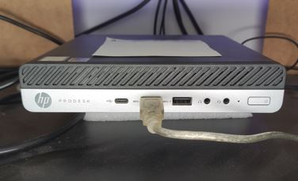

# home-assistant-config

This is the home-assistant configuration which I'm using in my little appartment.
I'm focussing on cloud-less solutions since I value having light and heating when the internet doesn't work.

# Hardware
This is a very short list of the hardware I'm using:

## Core
HP Prodesk 600 G3 Desktop mini (Intel Core i5-7500T CPU with 16GB of RAM).

## Zigbee
* ConbeeII stick (Zigbee/Deconz)
* Xiaomi Aqara temperature and humidity sensor (living room, kitchen, bathroom, office, bedroom, terrace)
* Xiaomi Aqara motion sensor (hall)
* Xiaomi Mi Smart plug ZNCZ04LM (bathroom fan)
* Osram Smart+ Motion sensors (hall/pantry)
* Osram Smart+ Switch mini (hall, living room)
* Osram Smart+ Light bulb (living room x2)
* Ledvance Smart+ smart plug AB32570 (living room)
* Philips Hue spots GU10 (hall, toilet)
* Ikea TRÅDFRI motion sensor
* Ikea TRÅDFRI dimmer button
* Ikea TRÅDFRI 1055 lumen E27 bulb

## Homematic
* HM-MOD-RPI-PCB (Homematic/Raspberrymatic) on a Raspberry Pi-3B running from a USB SSD
* Homematic basic thermostat (living + office)

## ESPHome
* GoSund (/Tuya) SP-112 wifi power plug (x4)
* GoSund (/Tuya) SP-1 wifi power plug (x2)

## Tasmota
* Athom Tasmota EU plug V2 (x2)

## WLED
* [ESP8266](doc/img/wled.jpg) (living room x2, office x2)
  * Mean Well LPV100-12/Ledmo HTY-1200500 adapter
  * BTF-Lighting WS2811 BTF-12V-60L-W

## Other hardware
* Roomba 690
* Foscam R2M Wifi camera
* Fluvius Smart meter with [SlimmeLezer](https://www.zuidwijk.com/slimmelezer-smartreader/)
* ~~HP Touchpad with Evervolv ROM to run Wallpanel on (appdaemon dashboard)~~ (dead again)

## Other integration
* ☁ CO2 Signal
* ☁ ~~OpenSenseMap~~ (too often unavailable)
* ☁ Luftdaten
* ☁ Met.no weather
* ~~Bluetooth Device Tracker~~ (broken due to HA changing bluetooth implementation, also no bluetooth on the HP Prodesk)
* Nmap Device Tracker
* ~~Raspberry Pi Power Supply Checker~~
* ☁ Waze Travel Time
* ☁ Buienradar
* ☁ ~~Speedtest~~ (removed it because of [this PR](https://github.com/home-assistant/core/pull/84295))
* Onvif (for the Foscam IP camera)
* MQTT

# Installation
I'm running HAOS as a virtual machine on Proxmox in a 2 core 4GB VM.

On the same proxmox installation I also run the following service for HA:
* Postgresql
* InfluxDB v2
* Mosquitto MQTT broker